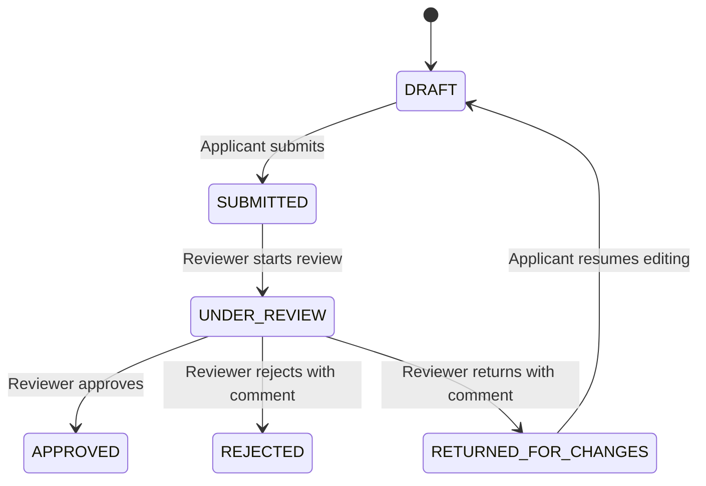

# Claimflow

Claimflow is a full-stack claims workflow application for submitting, reviewing, and approving expense claims. It separates applicant and reviewer responsibilities, enforces role-based authorization, and records status changes in an audit trail.

## Project Structure

```text
Claimflow/
  backend/      NestJS API, PostgreSQL persistence, JWT auth, workflow rules
  frontend/     React + Vite user interface
  docker-compose.yml
```

## Core Features

- Applicant and reviewer login using JWT authentication.
- Applicants can create draft claims with category, description, amount, and optional attachment.
- Applicants can edit only their own draft claims.
- Applicants can submit claims for review.
- Reviewers can list submitted claims, start review, approve, reject, or return claims for changes.
- Rejection and return-for-changes actions require reviewer comments.
- Every application creation and status transition is written to an audit log.

## Workflow



## Technology Stack

- Frontend: React, Vite, TypeScript, React Query, Axios, Tailwind CSS
- Backend: NestJS, TypeScript, TypeORM, Passport JWT, bcrypt
- Local database: SQLite through TypeORM
- Deployment database: PostgreSQL through TypeORM
- Local infrastructure: Docker Compose for PostgreSQL

## Local Setup

### Local Database

Local development can run without Docker or PostgreSQL by using SQLite.

Create `Claimflow/backend/.env` from `Claimflow/backend/.env.example`, then use:

```text
DB_TYPE=sqlite
DB_DATABASE=claimflow.sqlite
```

TypeORM creates the SQLite database file automatically when the backend starts.

For PostgreSQL deployment, set `DB_TYPE=postgres` and provide `DB_HOST`, `DB_PORT`, `DB_USERNAME`, `DB_PASSWORD`, and `DB_DATABASE`.

### Backend

```powershell
cd Claimflow\backend
npm install
npm run start:dev
```

The backend defaults to `http://localhost:3000`.

### Frontend

```powershell
cd Claimflow\frontend
npm install
npm run dev
```

The frontend uses `VITE_API_URL` when provided, otherwise it calls `http://localhost:3000`.

## Seed Users

| Role | Email | Password |
| --- | --- | --- |
| Applicant | `applicant@test.com` | `password123` |
| Reviewer | `reviewer@test.com` | `password123` |

## Main API Areas

- `POST /auth/login`
- `GET /applications/my`
- `POST /applications`
- `PATCH /applications/:id`
- `POST /applications/:id/submit`
- `POST /applications/:id/draft`
- `GET /reviewer/applications`
- `GET /reviewer/applications/:id`
- `POST /reviewer/applications/:id/start-review`
- `POST /reviewer/applications/:id/approve`
- `POST /reviewer/applications/:id/reject`
- `POST /reviewer/applications/:id/return`

## Testing Strategy

- Unit tests cover workflow transition rules.
- E2E tests cover API behavior, authentication, authorization, and audit logging.
- Invalid transitions are tested to ensure illegal workflow changes are blocked.

## Documentation

- [Software Design Document](SOFTWARE_DESIGN_DOCUMENT.md)
- [Architecture Diagram](ARCHITECTURE_DIAGRAM.md)
- [Database ERD](DATABASE_ERD.md)
- [Test Plan](TEST_PLAN.md)
