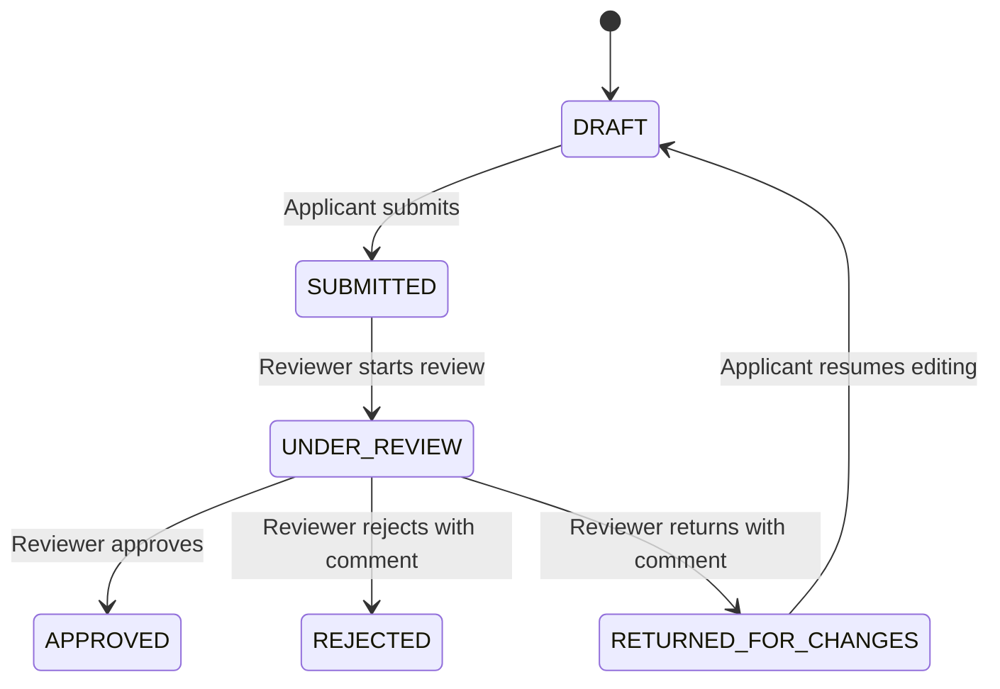

# Claimflow

Claimflow is a full-stack claims workflow application for submitting, reviewing, and approving expense claims. It separates applicant and reviewer responsibilities, enforces role-based authorization, and records status changes in an audit trail.

## Project Structure

```text
Claimflow/
  backend/      NestJS API, PostgreSQL persistence, JWT auth, workflow rules
  frontend/     React + Vite user interface
  docker-compose.yml full local Docker stack
```

## Core Features

- Applicant and reviewer login using JWT authentication.
- Applicants can create draft claims with category, description, amount, and optional attachment.
- Applicants can edit only their own draft claims.
- Applicants can submit claims for review.
- Reviewers can list submitted claims, start review, approve, reject, or return claims for changes.
- Rejection and return-for-changes actions require reviewer comments.
- Every application creation and status transition is written to an audit log.

## Workflow



## Technology Stack

- Frontend: React, Vite, TypeScript, Axios, Tailwind CSS
- Backend: NestJS, TypeScript, TypeORM, Passport JWT, bcrypt
- Local development: Docker Compose for frontend, backend, and PostgreSQL
- Local fallback database: SQLite through TypeORM
- Deployment database: PostgreSQL through TypeORM

## Local Setup

### Docker Setup

The recommended local setup runs the whole application with Docker Compose.

Prerequisites:

- Docker Desktop
- Windows Subsystem for Linux 2, if running on Windows

On Windows, if Docker Desktop says the engine cannot start, open PowerShell as Administrator and run:

```powershell
wsl --install
```

Restart Windows if prompted, then start Docker Desktop.

From the repository root, run:

```powershell
cd Claimflow
docker compose up -d --build
```

The app will be available at:

- Frontend: `http://localhost:5173`
- Backend API: `http://localhost:3000`
- PostgreSQL: `localhost:5432`

Stop the stack with:

```powershell
docker compose down
```

To reset the local PostgreSQL data as well:

```powershell
docker compose down -v
```

### Manual Local Setup

You can also run the app without Docker by installing dependencies locally.

For SQLite, create `Claimflow/backend/.env` and use:

```text
DB_TYPE=sqlite
DB_DATABASE=claimflow.sqlite
JWT_SECRET=super-secret-key-change-in-production
PORT=3000
```

TypeORM creates the SQLite database file automatically when the backend starts.

For PostgreSQL deployment, set `DB_TYPE=postgres` and provide `DB_HOST`, `DB_PORT`, `DB_USERNAME`, `DB_PASSWORD`, and `DB_DATABASE`.
Set `JWT_SECRET` in every non-test environment. The API fails fast when this secret is missing.

### Backend

```powershell
cd Claimflow\backend
npm install
npm run start:dev
```

The backend defaults to `http://localhost:3000`.

### Frontend

```powershell
cd Claimflow\frontend
npm install
npm run dev
```

The frontend uses `VITE_API_URL` when provided, otherwise it calls `http://localhost:3000`.

## Seed Users

| Role | Email | Password |
| --- | --- | --- |
| Applicant | `applicant@test.com` | `password123` |
| Reviewer | `reviewer@test.com` | `password123` |

## Main API Areas

- `POST /auth/login`
- `GET /applications/my`
- `POST /applications`
- `PATCH /applications/:id`
- `POST /applications/:id/submit`
- `POST /applications/:id/draft`
- `GET /reviewer/applications`
- `GET /reviewer/applications/:id`
- `POST /reviewer/applications/:id/start-review`
- `POST /reviewer/applications/:id/approve`
- `POST /reviewer/applications/:id/reject`
- `POST /reviewer/applications/:id/return`

## Testing Strategy

- Unit tests cover workflow transition rules.
- E2E tests cover API behavior, authentication, authorization, and audit logging.
- Invalid transitions are tested to ensure illegal workflow changes are blocked.

## Known Trade-Offs And Next Steps

- Status transitions and audit-log writes are wrapped in a database transaction so a claim cannot change state without its audit entry.
- Reviewer claim queries intentionally exclude applicant drafts; reviewers only see submitted, in-review, and terminal claims.
- Production disables TypeORM schema auto-sync. The next production-hardening step is to add explicit migrations for repeatable schema changes.
- Uploaded files are stored on local disk for this assessment. In production, move attachments to object storage such as S3 or Render persistent disk.
- Concurrent reviewer actions should be protected with optimistic locking or a status precondition check in the transition transaction.
- AI assistance: Codex was used to review, implement, and verify changes; build and test output was checked manually before submission.

## Documentation

- [Software Design Document](docs/SOFTWARE_DESIGN_DOCUMENT.md)
- [Architecture Diagram](docs/ARCHITECTURE_DIAGRAM.md)
- [Database ERD](docs/DATABASE_ERD.md)
- [Test Plan](docs/TEST_PLAN.md)
