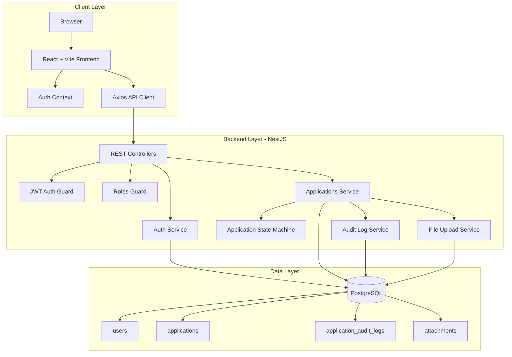
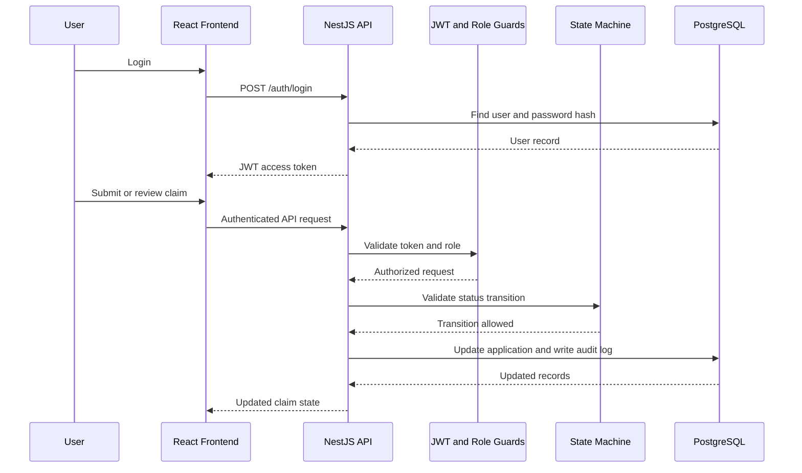
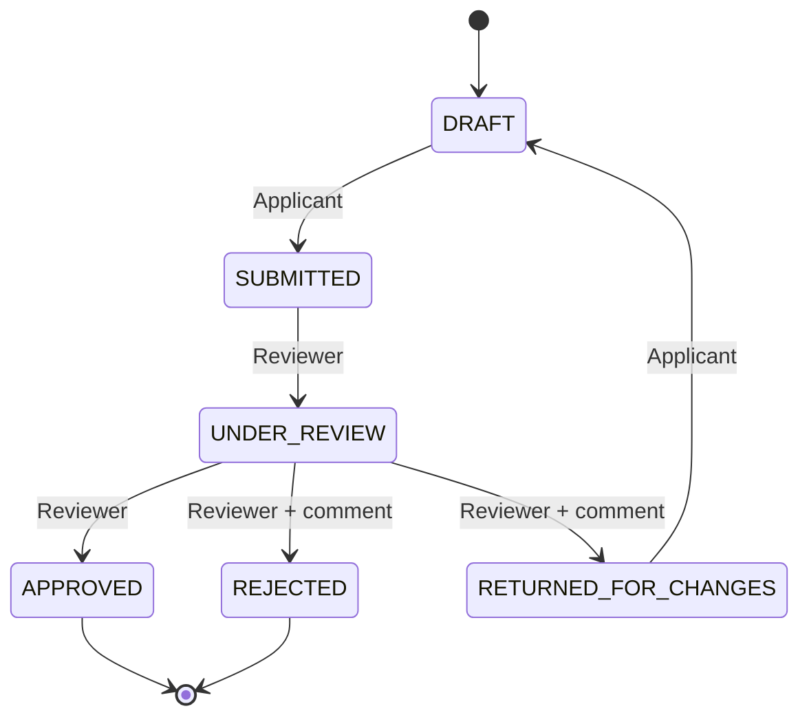

# Architecture Diagram

## High-Level Architecture

## Request Flow

## Workflow State Machine

## Component Responsibilities

| Component | Responsibility |
| --- | --- |
| React Frontend | User interface for login, applicant dashboard, reviewer dashboard, and claim detail screens |
| Axios API Client | Sends API requests and attaches JWT bearer tokens |
| NestJS Controllers | Define applicant and reviewer REST endpoints |
| JWT Auth Guard | Rejects unauthenticated requests |
| Roles Guard | Enforces applicant-only and reviewer-only routes |
| Applications Service | Owns claim use cases and persistence orchestration |
| State Machine Service | Validates legal workflow transitions |
| Audit Log Service | Records application creation and status changes |
| PostgreSQL | Persists users, applications, audit logs, and attachments |
