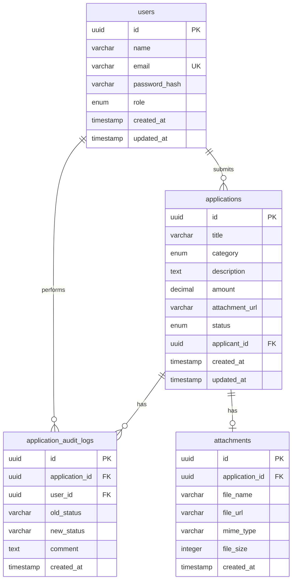

# Database ERD

## Entity Relationship Diagram

## Tables

### users

| Column | Type | Notes |
| --- | --- | --- |
| `id` | UUID | Primary key |
| `name` | varchar | Display name |
| `email` | varchar | Unique login email |
| `password_hash` | varchar | bcrypt password hash |
| `role` | enum | `APPLICANT` or `REVIEWER` |
| `created_at` | timestamp | Created timestamp |
| `updated_at` | timestamp | Updated timestamp |

### applications

| Column | Type | Notes |
| --- | --- | --- |
| `id` | UUID | Primary key |
| `title` | varchar | Claim title |
| `category` | enum | `TRAVEL`, `FUEL`, `INTERNET`, `MEALS`, `EQUIPMENT`, `OTHER` |
| `description` | text | Optional claim details |
| `amount` | decimal(10,2) | Claim amount |
| `attachment_url` | varchar | Optional attachment location |
| `status` | enum | Current workflow status |
| `applicant_id` | UUID | Foreign key to `users.id` |
| `created_at` | timestamp | Created timestamp |
| `updated_at` | timestamp | Updated timestamp |

### application_audit_logs

| Column | Type | Notes |
| --- | --- | --- |
| `id` | UUID | Primary key |
| `application_id` | UUID | Foreign key to `applications.id` |
| `user_id` | UUID | Foreign key to `users.id` |
| `old_status` | varchar | Previous status, nullable for creation |
| `new_status` | varchar | New status |
| `comment` | text | Optional transition comment |
| `created_at` | timestamp | Time of event |

### attachments

| Column | Type | Notes |
| --- | --- | --- |
| `id` | UUID | Primary key |
| `application_id` | UUID | Foreign key to `applications.id` |
| `file_name` | varchar | Original or stored file name |
| `file_url` | varchar | File URL or local reference |
| `mime_type` | varchar | MIME type |
| `file_size` | integer | Size in bytes |
| `created_at` | timestamp | Created timestamp |

## Relationship Rules

- A user with role `APPLICANT` can own many applications.
- An application belongs to exactly one applicant.
- An application can have many audit log entries.
- A user can perform many audit log events.
- An application can have zero or one attachment record.
- Deleting a user cascades to their applications and audit logs through configured relations.
- Deleting an application cascades to its audit logs and attachment relation.
