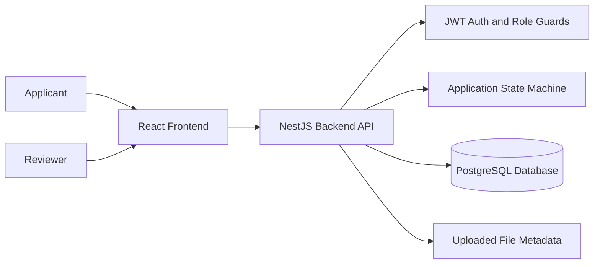

# Software Design Document

## 1. Purpose

Claimflow manages expense claim submissions through a controlled workflow. Applicants create and submit claims, while reviewers evaluate submitted claims and approve, reject, or return them for changes.

The system emphasizes role-based authorization, predictable workflow transitions, and traceable audit history.

## 2. Scope

The current implementation includes:

- JWT-based login.
- Applicant claim creation, editing, viewing, and submission.
- Reviewer claim listing, filtering, viewing, and workflow decisions.
- SQLite local persistence and PostgreSQL deployment persistence through TypeORM entities.
- A state machine service that validates legal status transitions.
- Audit logs for application creation and status changes.
- Optional file attachment metadata for claims.

## 3. System Context

## 4. Architecture Overview

The application uses a client-server architecture.

The frontend is a React application built with Vite. It handles login, stores the JWT token in browser local storage, attaches the token to API requests through an Axios interceptor, and displays applicant or reviewer workflows based on the authenticated user's role.

The backend is a NestJS application. It exposes REST endpoints, authenticates requests with JWT, checks role permissions with guards and decorators, applies workflow rules through the state machine service, and persists data using TypeORM.

TypeORM stores users, applications, attachments, and audit logs. Local development uses SQLite, while PostgreSQL remains supported for deployment.

## 5. Backend Modules

### Auth Module

Responsibilities:

- Validate login credentials.
- Compare submitted passwords with stored bcrypt hashes.
- Issue JWT access tokens.
- Protect routes with JWT strategy and guards.

Primary files:

- `Claimflow/backend/src/auth/auth.controller.ts`
- `Claimflow/backend/src/auth/auth.service.ts`
- `Claimflow/backend/src/auth/jwt.strategy.ts`
- `Claimflow/backend/src/auth/guards/jwt-auth.guard.ts`
- `Claimflow/backend/src/auth/guards/roles.guard.ts`

### Applications Module

Responsibilities:

- Create draft applications for applicants.
- Update applicant-owned draft applications.
- Return applicant-specific application lists.
- Return reviewer application lists.
- Execute workflow transitions.
- Attach audit log entries to application detail responses.

Primary files:

- `Claimflow/backend/src/applications/applications.controller.ts`
- `Claimflow/backend/src/applications/applications.service.ts`

### State Machine Module

Responsibilities:

- Validate whether a status transition is allowed.
- Enforce role restrictions.
- Require comments for rejected and returned claims.

Allowed applicant transitions:

| From | To |
| --- | --- |
| `DRAFT` | `SUBMITTED` |
| `RETURNED_FOR_CHANGES` | `DRAFT` |

Allowed reviewer transitions:

| From | To |
| --- | --- |
| `SUBMITTED` | `UNDER_REVIEW` |
| `UNDER_REVIEW` | `APPROVED` |
| `UNDER_REVIEW` | `REJECTED` |
| `UNDER_REVIEW` | `RETURNED_FOR_CHANGES` |

Primary file:

- `Claimflow/backend/src/state-machine/state-machine.service.ts`

### Audit Log Module

Responsibilities:

- Record the initial draft creation event.
- Record each workflow transition.
- Provide ordered history for application detail screens.

### File Upload Module

Responsibilities:

- Save uploaded file metadata.
- Link an attachment record to an application.

## 6. Frontend Structure

The frontend is organized around pages, shared API utilities, and authentication context.

Primary files:

- `Claimflow/frontend/src/pages/Login.tsx`
- `Claimflow/frontend/src/pages/ApplicantDashboard.tsx`
- `Claimflow/frontend/src/pages/ReviewerDashboard.tsx`
- `Claimflow/frontend/src/pages/ClaimDetail.tsx`
- `Claimflow/frontend/src/context/AuthContext.tsx`
- `Claimflow/frontend/src/utils/api.ts`

The frontend sends authenticated API requests through a shared Axios instance. The instance adds the JWT bearer token from `localStorage` when available.

## 7. Data Model

The main domain entities are:

- `User`
- `Application`
- `Attachment`
- `AuditLog`

Applications belong to applicants. Audit logs belong to both applications and users. Attachments are linked one-to-one with applications.

See [Database ERD](DATABASE_ERD.md) for the entity relationship diagram.

## 8. Security Design

Authentication:

- Users authenticate through `POST /auth/login`.
- The backend returns a JWT access token.
- Protected endpoints require a valid bearer token.

Authorization:

- Applicant endpoints require the `APPLICANT` role.
- Reviewer endpoints require the `REVIEWER` role.
- Applicants can only read or update their own applications.
- Applicants can only edit applications in `DRAFT` status.
- Reviewers cannot execute applicant-only transitions.
- Applicants cannot execute reviewer-only transitions.

Password handling:

- Seeded user passwords are hashed with bcrypt before storage.

## 9. Workflow Design

The workflow is implemented as an explicit state machine service. This keeps transition rules separate from route handlers and persistence logic.

Status values:

- `DRAFT`
- `SUBMITTED`
- `UNDER_REVIEW`
- `APPROVED`
- `REJECTED`
- `RETURNED_FOR_CHANGES`

The service returns:

- `ForbiddenException` when the user's role is not allowed to perform an otherwise valid transition.
- `BadRequestException` when the transition itself is invalid.
- `BadRequestException` when a required comment is missing.

## 10. Auditability

Every new claim starts with an audit entry from `null` to `DRAFT`. Each later status transition records:

- Application ID
- Acting user ID
- Old status
- New status
- Optional comment
- Timestamp

## 11. Database Configuration

Local development uses SQLite when `DB_TYPE=sqlite`. This creates a local `claimflow.sqlite` file and avoids requiring Docker or a PostgreSQL service.

Production or deployment environments can use PostgreSQL by setting `DB_TYPE=postgres` and providing the normal PostgreSQL connection settings.

## 12. Deployment Notes

The repository includes `docker-compose.yml` for PostgreSQL when needed. The backend currently uses TypeORM `synchronize: true`, which is convenient for development but should be replaced with migrations before production deployment.

Recommended production hardening:

- Disable TypeORM schema synchronization.
- Add database migrations.
- Move secrets into managed environment variables.
- Use persistent object storage for uploaded files.
- Add refresh tokens or session expiration handling.
- Add API rate limiting and structured request logging.
